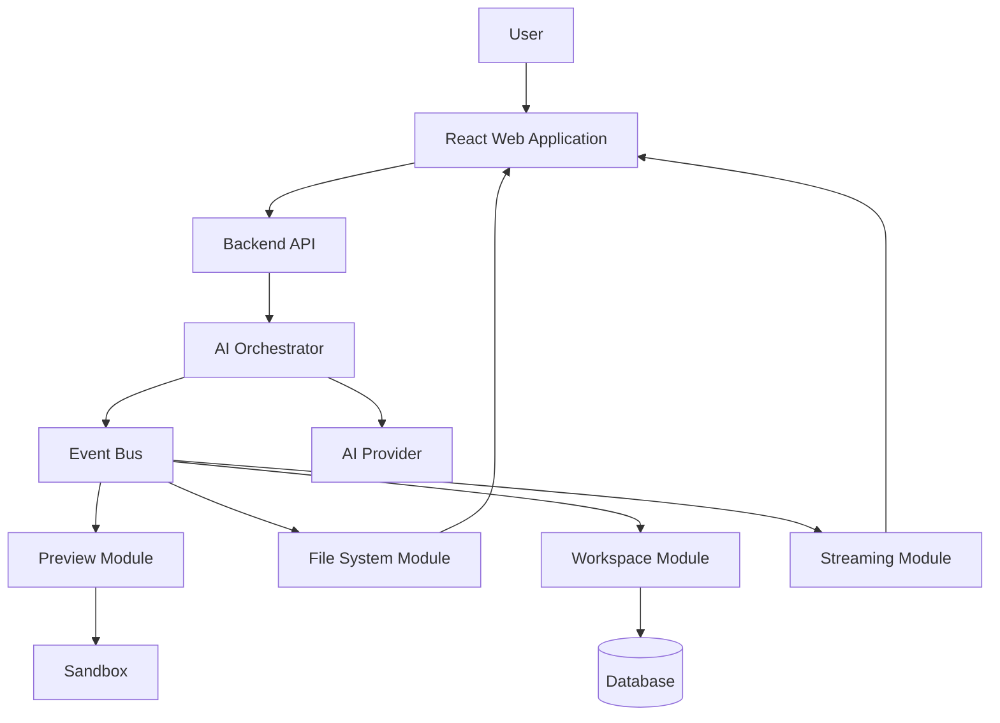

# High Level Design (HLD)

> **Title:** High Level Design
>
> **Version:** 1.0
>
> **Status:** Draft
>
> **Owner:** Project Asteria Team
>
> **Last Updated:** July 2, 2026
>
> **Related Documents:**
>
> * `docs/product/vision.md`
> * `docs/product/prd.md`

---

# Purpose

This document defines the high-level architecture of Project Asteria.

It identifies the major system components, their responsibilities, the communication flow between them, and the architectural principles that guide the implementation.

This document intentionally avoids implementation details. Those belong in the Low Level Design (LLD).

---

# Architectural Goals

The architecture should satisfy the following goals:

* Transparent software generation
* Real-time streaming
* Event-driven communication
* Modular backend design
* Extensible AI orchestration
* Maintainable codebase
* Clear separation of responsibilities
* Future scalability

---

# System Overview

Project Asteria is an Event-Driven AI Software Engineering Platform.

Instead of treating AI generation as a single request and response, the system models software generation as a sequence of engineering events.

Every meaningful action produces an event.

Those events update the user interface, engineering timeline, preview, and project state.

---

# High Level Architecture



---

# Core Components

## React Web Application

Responsibilities

* Chat interface
* File explorer
* Code editor
* Live preview
* Engineering timeline
* User interaction

The frontend is responsible only for presentation and user interaction.

Business logic remains on the backend.

---

## Backend API

Responsibilities

* Receive client requests
* Manage authentication (future)
* Manage sessions
* Coordinate backend modules
* Expose HTTP and streaming endpoints

The Backend API acts as the entry point into the platform.

---

## AI Orchestrator

Responsibilities

* Build prompts
* Load project context
* Communicate with AI providers
* Interpret AI responses
* Produce engineering events

The orchestrator is the brain of the platform.

It never directly updates the frontend.

Instead, it emits events.

---

## Event Bus

Responsibilities

* Publish events
* Deliver events to interested modules
* Decouple backend components

The Event Bus is the heart of the architecture.

Every major engineering action becomes an event.

Examples include:

* PlanningStarted
* PlanningCompleted
* FileCreated
* FileUpdated
* DependencyInstallationStarted
* DependencyInstallationCompleted
* PreviewStarted
* PreviewReady
* GenerationCompleted

---

## Streaming Module

Responsibilities

* Subscribe to backend events
* Stream updates to connected clients
* Preserve event ordering

This module provides the real-time experience of Asteria.

---

## Workspace Module

Responsibilities

* Create workspaces
* Load workspaces
* Persist workspaces
* Manage sessions

---

## File System Module

Responsibilities

* Create files
* Update files
* Delete files
* Maintain project structure

This module owns the project's filesystem.

---

## Preview Module

Responsibilities

* Build projects
* Launch preview
* Restart preview after changes
* Report build failures

---

## Sandbox

Responsibilities

* Execute generated applications
* Isolate user projects
* Prevent unsafe execution

The sandbox provides a secure environment for running generated applications.

---

## Database

Responsibilities

* Store workspaces
* Store sessions
* Store project metadata
* Store conversation history

---

## AI Provider

Responsibilities

* Generate engineering plans
* Generate source code
* Modify existing projects
* Explain engineering decisions

The AI provider is treated as an external dependency.

Replacing providers should require minimal architectural changes.

---

# Event Driven Architecture

Every engineering operation is represented as one or more events.

Example flow:

```text
User Prompt

↓

Prompt Received

↓

Planning Started

↓

Planning Completed

↓

File Created

↓

File Updated

↓

Dependency Installation Started

↓

Dependency Installation Completed

↓

Preview Started

↓

Preview Ready

↓

Generation Completed
```

This approach allows every subsystem to react independently without tight coupling.

---

# Design Principles

The architecture follows these principles:

* Event-driven communication
* Single responsibility for each module
* Loose coupling
* High cohesion
* Separation of concerns
* Extensibility before complexity
* Developer transparency

---

# Future Evolution

The MVP will be implemented as a modular monolith.

As the platform grows, individual modules may evolve into independent services without requiring significant architectural redesign.

Potential future service boundaries include:

* AI Service
* Preview Service
* Workspace Service
* Notification Service

---

# Out of Scope

This document does not define:

* Internal module implementation
* API endpoints
* Database schema
* Event payloads
* Deployment architecture

These topics will be covered in subsequent architecture documents.

---

# Summary

Project Asteria is designed around a central Event Bus that coordinates all major engineering activities.

Every important operation emits events that drive the user experience.

This architecture aligns with Asteria's philosophy of transparency, incremental progress, and engineering-first AI assistance.
