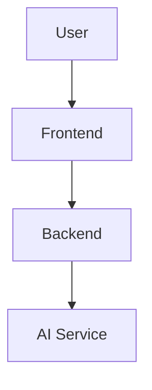

# Documentation Standard

> **Document:** Documentation Standard
> **Version:** 1.0
> **Status:** Approved
> **Owner:** Project Asteria Team
> **Last Updated:** July 2, 2026

---

# Purpose

This document defines the documentation conventions used throughout Project Asteria.

The objective is to ensure consistency, readability, maintainability, and professionalism across all project documentation.

Every major engineering artifact should follow these standards.

---

# Documentation Philosophy

Documentation is treated as an engineering artifact rather than a by-product.

Every document should answer one or more of the following questions:

* Why does this exist?
* What problem does it solve?
* How does it work?
* Why was this decision made?
* What should future contributors know?

Documentation should evolve together with the codebase.

---

# Repository Documentation Structure

```text
docs/
│
├── product/
│
├── architecture/
│
├── adr/
│
├── learning/
│
└── journal/
```

Each directory has a clearly defined responsibility.

## product/

Product-related documentation.

Examples:

* Vision
* PRD
* Personas
* Roadmap
* Product Principles

---

## architecture/

System design documentation.

Examples:

* High-Level Design
* Low-Level Design
* API Design
* Event Flow
* Data Flow
* Security
* Deployment
* State Management

---

## adr/

Architecture Decision Records.

Each ADR documents:

* Context
* Decision
* Alternatives
* Consequences

---

## learning/

Engineering notes created during development.

Topics include:

* React
* TypeScript
* Node.js
* Streaming
* Docker
* Kubernetes
* CI/CD
* AI Engineering

These documents exist to reinforce understanding rather than describe the project itself.

---

## journal/

Engineering retrospectives.

One entry should be written after each completed sprint.

---

# Document Metadata

Every major document must begin with the following metadata.

```yaml
Title:
Version:
Status:
Owner:
Last Updated:
Related Documents:
```

Example:

```yaml
Title: Product Requirements Document

Version: 1.0

Status: Draft

Owner: Project Asteria Team

Last Updated: July 2, 2026

Related Documents:

- vision.md

- roadmap.md
```

---

# Document Status

Documents should always have one of the following statuses.

* Draft
* In Review
* Approved
* Implemented
* Deprecated

---

# Versioning

Documentation follows semantic versioning.

Examples:

* v0.1 – Initial draft
* v0.5 – Major sections completed
* v0.9 – Ready for review
* v1.0 – Approved
* v1.1 – Minor revisions
* v2.0 – Major restructuring

---

# Writing Guidelines

Documentation should:

* Prioritize clarity over length.
* Explain the reasoning behind decisions.
* Avoid implementation details unless appropriate for the document.
* Use diagrams where they improve understanding.
* Prefer tables for structured information.
* Remain implementation-agnostic whenever possible.

---

# Markdown Conventions

* Use ATX headings (`#`, `##`, `###`).
* Use fenced code blocks with language identifiers.
* Use tables for structured data.
* Keep paragraphs concise.
* Use bullet lists for readability.

---

# Diagrams

Architecture diagrams should be written using Mermaid whenever practical.

Example:



---

# Naming Conventions

Documents should use lowercase kebab-case filenames.

Examples:

* vision.md
* prd.md
* hld.md
* api-design.md
* event-flow.md

---

# Review Process

Every major document follows the same lifecycle.

1. Discussion
2. Draft
3. Technical Review
4. Revision
5. Approval
6. Repository Commit

---

# Engineering Principle

Every document should answer **why**, not only **what**.

Future contributors should be able to understand the reasoning behind important engineering decisions without referring to external discussions.